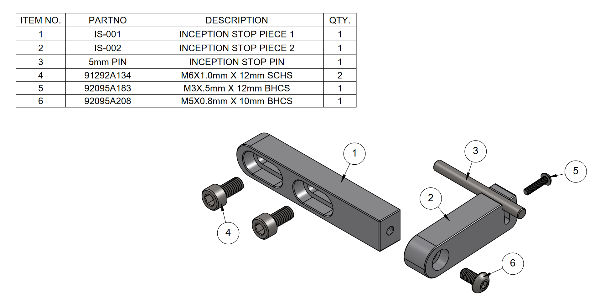

# Inception Vise Stop

A adjustable stop for the inception vise

**NOTES**
1. You will need to do some manual drilling and tapping for IS-002.
2. Work holding can be a little challenging for IS-002. I put a 5mm pin in the slot while I cut the c'bored hole for the M3 bolt. Reach out to me on discord if you have any questions about how I held this part.
3. The part numbers for the hardware are McMaster-Carr parts

| ITEM NO. | PARTNO    | DESCRIPTION               | QTY. |
|----------|-----------|---------------------------|------|
| 1        | IS-001    | INCEPTION STOP PIECE 1    | 1    |
| 2        | IS-002    | INCEPTION STOP PIECE 2    | 1    |
| 3        | 5mm PIN   | INCEPTION STOP PIN        | 1    |
| 4        | 91292A134 | M6X1.0mm X 12mm SCHS      | 2    |
| 5        | 92095A183 | M3X.5mm X 12mm BHCS       | 1    |
| 6        | 92095A208 | M5X0.8mm X 10mm BHCS      | 1    |

---

  

